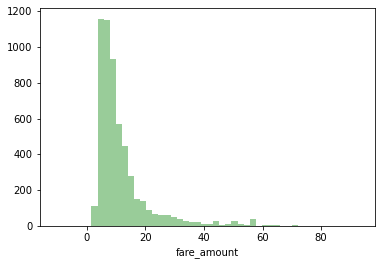

# Project 4: New York City Taxi Fare Prediction

## Problem statement

In this project we tackle the competition hosted in partnership with Google Cloud and Coursera, you are tasked with predicting the fare amount (inclusive of tolls) for a taxi ride in New York City given the pickup and dropoff locations. [source](https://www.kaggle.com/c/new-york-city-taxi-fare-prediction/overview)

## Datasets

Note: Datasets present in folder `data`
- `train.csv`: original train dataset taken from kaggle. Input features and target fare_amount values for the training set (about 55M rows).
- `test.csv`: original test dataset taken from kaggle. Input features for the test set (about 10K rows). 
- `mod_dataset.csv`: processed `train.csv` dataset, which includes only cleaned data and engineered features for modeling portion. 
- `preds_dataset.csv:` predictions of `fare_amount` based on `test.csv`. 
## Features [before preprocessing]

    - `pickup_datetime` - timestamp value indicating when the taxi ride started.
    - `pickup_longitude` - float for longitude coordinate of where the taxi ride started.
    - `pickup_latitude` - float for latitude coordinate of where the taxi ride started.
    - `dropoff_longitude` - float for longitude coordinate of where the taxi ride ended.
    - `dropoff_latitude` - float for latitude coordinate of where the taxi ride ended.
    - `passenger_count` - integer indicating the number of passengers in the taxi ride.
    
## Features [After preprocessing + selecting best original]
- `fare_amount` - float dollar amount of the cost of the taxi ride.
- `passenger_count` - integer indicating the number of passengers in the taxi ride.
- `distance` - distance in KM from pickup and dropoff locations.
- `month` - month extracted from the original feature of `pickup_datetime`
- `year` - year extracted from the original feature of `pickup_datetime`

## Visualizations

- Comment: We can see a highly skewed distribution of the feature `fare_amount`.

- Comment: We can see a highly skewed distribution of the feature `passenger_count`.

- Comment: The correlation matrix allow us to see that the engineered features are the ones that might help us generate a solid predictive model.

- Comment: We can see how the `fare_amount` is influenced by each month.

- Comment: We can see how the `fare_amount` is influenced by each year.

### 4. Models
The following table shows the summary of all the models created: 

| Model                   | Score on training set  | Score on testing set  |
|-------------------------|------------------------|-----------------------|
| RFC+GS                  | ~ 0.68                 | ~ 0.63                |
| RFC                     | ~ 0.61                 | ~ 0.54                |
| Lasso                   | ~ 0.11                 | ~ 0.10                |

### 5. Conclusion + Recommendations

The model with the best performance is the `RandomForestRegressor`. Due to the fact that I decided to use boostrap samples of around .1% and .01% of the original training dataset there is a high chance that my models could have performed better with larger bootstrap samples. It would be recommended to try to model this data in google colab where the processing power might allow to train on larger datasets.